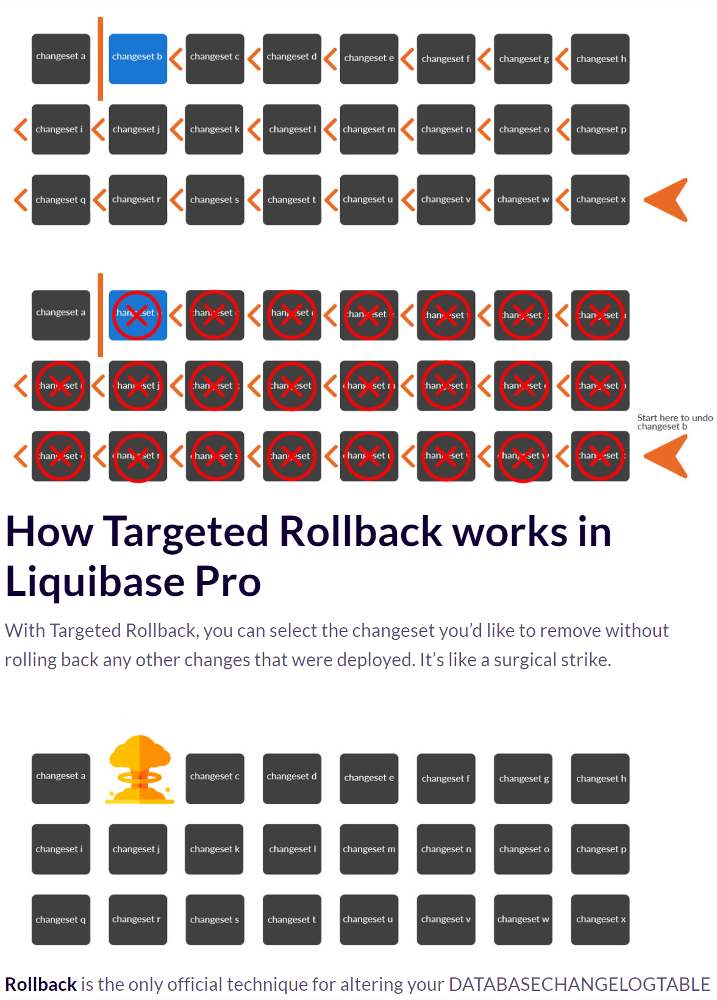

# flyway vs liquibase

## flyway

- 社区版、团队版、企业版本
- 集成引入jar即可
- 社区版不支持回滚
- 支持sql文件、声明代码迁移，sql文件命名需按照既定格式命名
  > V_版本号_文件名: 升级文件    
  U_版本号_文件名: 回滚文件   
  R_版本号_文件名: 可重复执行文件
- 支持maven插件执行迁移命令

## liquibase

- 社区版支持回滚、以及diff数据库操作，社区回滚即按照版本顺序一次回滚直至指定版本，而商业版可定向回滚
- 集成引入jar即可
- 支持xml、json、yaml配置方式迁移，需按照既定的schema来编写，同时也支持在配置文件中直接引入sql脚本
- 支持maven插件执行迁移、反向生成迁移xml文件、校验、diff等命令

## 对比
1. flyway与liquibase都支持常见数据库如mysql系、Oracle、SQLLite、DB2、SQL Server等([liquibase支持列表](https://docs.liquibase.com/install/tutorials/home.html))([flyway支持列表](https://documentation.red-gate.com/fd))
2. flyway相比liquibase简单易用,只需按命名规则将sql文件放置指定目录([默认加载目录](flyway/src/main/resources/db/migration))即可， 
   而liquibase则需编写相应的描述文件如[xml](liquibase/src/main/resources/db/changelog/changelog_1.xml)，不过通过编写xml liquibase可以跨库使用，flyway跨库则需按照方言改写sql
3. flyway社区版不支持回滚   
   [flyway各个版本及功能](https://www.red-gate.com/products/flyway/editions)   
   liquibase社区版支持[回滚](https://www.liquibase.com/blog/targeted-rollback)但回滚为按相反顺序依次回滚，定向回滚则需要专业版   
   
4. flyway社区版不支持diff，liquibase社区版支持diff可以比较两个数据库差异
5. flyway社区版仅支持高版本数据库，如[MySql](https://flywaydb.org/documentation/database/mysql)需8.0低版本则需团队版才支持
